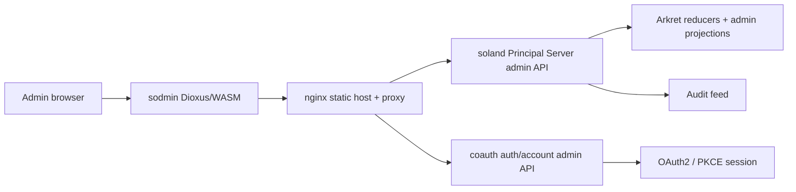

# sodmin

> **Spec target**: [arkret-spec @ c2848a4](../arkret-spec) (R3.4 sync 2026-05-31)

Arkret administrator web UI for Principal Server and coauth deployments. The app is built with Dioxus and compiled to WebAssembly.

## Pre-commit hook setup

After cloning, enable the project's pre-commit hooks:

```sh
git config core.hooksPath .githooks
```

The hook runs `cargo fmt --all -- --check` and `cargo clippy --no-deps -- -D
warnings` on staged Rust changes. If `.githooks/pre-commit` is missing on
a branch, copy it from
[`arkret-rust-sdk`](https://github.com/arkret-org/arkret-rust-sdk) and
adapt to your local toolchain.

## Scope

- **Dashboard**: server profile, health, storage and conformance status.
- **Actors**: search, detail, devices, sessions, DID/handle and lifecycle status.
- **Realms**: membership, invites, visibility, policy and destructive actions with audit context (a Realm is the security boundary; Spaces are navigation containers within it).
- **Devices and capabilities**: trust state, key status, grants, delegations and effective permission review.
- **Federation**: peers, service DIDs, transactions, replay/fork quarantine and verification status.
- **Blob/media**: quota, metadata, retention and anti-enumeration diagnostics.
- **coauth**: accounts, sessions, upstream providers, OAuth2 clients, registration tokens, notification channels and audit logs.

`sodmin` does not implement Arkret reducers or authorization decisions. It consumes stable admin API contracts from `soland` and `coauth`.

## Architecture



## Realm vs Space

- **Realm:** security boundary — membership, capability, E2EE, and federation
  policies are administered here. URL prefix `/realms/:id/...`.
- **Space:** navigation container — board, list, section, calendar bucket.
  Lives inside a Realm.

The admin pages drive Realm boundary state through `/realms/:id/...`. The
**Realm links** page exposes typed `ak.realm.link` edges between boundaries.

## Round R4 (protocol review closures)

Spec round 4 (`arkret-spec` range `2a4d39b..a77b995`, 8 commits) lands
fresh admin surfaces on top of R2/R3. See [`CHANGELOG.md`](CHANGELOG.md)
`[Unreleased]` and [`../_sodmin_soland_todos.md`](../_sodmin_soland_todos.md) for the canonical
wire-breaking list. New admin views:

- **`ServiceDescribe` v2 detail** — all 17 fields rendered; the
  combination `development_mode=true` + non-empty `verified_profiles`
  paints red.
- **Delivery-binding handover panel** — shows the new error codes
  `delivery_binding_stale` / `delivery_binding_handed_over` /
  `historical_only`, with `new_recipient_service_id` and
  `handover_frontier` surfaced on stale rows.
- **3PID invite 5-state UI** — `claimed` / `send_failed` /
  `revoked_by_capability_loss` / `revoked_by_inviter_left` /
  `invalidated_by_rate_limit` are all displayed honestly; `send_failed`
  is never masked as success.
- **`deactivation_federation_incomplete` banner** — account-deactivation
  pages must surface this state instead of a silent "fully-deactivated"
  rendering.

## Round R2/R3 admin surfaces

Spec rounds 2+3 (2026-05-20) added several operator surfaces — see
[`CHANGELOG.md`](CHANGELOG.md) `[Unreleased]` and
[`../arkret-spec`](../arkret-spec) for the
normative source. The new admin pages:

- **Deactivation review** (`/deactivations/review`) — 7-domain fanout
  panel (session / device / applet / keypackage / push / to-device /
  capability) with per-domain retry. Reused on the Realm destroy page.
- **Realm destroy** (`/realms/:realm_id/destroy`) — destructive
  confirmation plus fanout and erasure receipt panels.
- **Key backup** (`/key-backup`) — recovery policies and receipts from
  the root identity recovery API.

## Development

```bash
cargo check
cargo test
dx serve --platform web
```

The UI reads `/config.json` at startup. A typical local config is:

```json
{
  "coauth_public_url": "http://localhost:7080"
}
```

## Build

```bash
cargo build --release
dx build --platform web --release
```

## Container

```bash
docker build -t sodmin .
docker run -p 9090:80 \
  -e SOLAND_URL=http://soland:8008 \
  -e COAUTH_URL=http://coauth:7080 \
  -e COAUTH_PUBLIC_URL=https://auth.example.com \
  sodmin
```

## Deployment

The local image bundles a static Dioxus/WASM build behind nginx. At
container start, `docker-entrypoint.sh` reads the runtime environment
and emits `/usr/share/nginx/html/config.json` plus an nginx vhost
configured with sane security headers.

Required and optional environment variables:

| Variable | Required | Purpose |
| --- | --- | --- |
| `SOLAND_URL` | yes | Internal URL of the soland Principal Server reached by the proxy. |
| `COAUTH_URL` | recommended | Internal URL of the coauth admin service. Enables the `/auth/`, `/_arkret/gate/`, `/_coauth/*`, `/authorize`, `/oauth/`, and `/.well-known/` proxy locations. |
| `COAUTH_PUBLIC_URL` | recommended | Browser-facing coauth origin. Written to `/config.json` for the OAuth2 PKCE redirect. |
| `SODMIN_PORT` | no | nginx listen port (default `80`). |

The rendered nginx config enables gzip for static assets and sets a tight
default Content-Security-Policy (`default-src 'self'; script-src 'self'
'wasm-unsafe-eval'; object-src 'none'; upgrade-insecure-requests; ...`),
HSTS, `X-Frame-Options: DENY`, `Referrer-Policy: no-referrer`, and a
`Permissions-Policy` that denies camera/microphone/geolocation/payment.
If the deployment fronts additional origins (e.g. external CDN, third
party auth), edit `connect-src` in `docker-entrypoint.sh` accordingly.

`/config.json` schema:

```json
{
  "coauth_public_url": "https://auth.example.com"
}
```

## API Clients

`coauth-admin-types` is consumed directly via the workspace path dependency,
and soland DTOs remain in the typed facade until a `soland-admin-types` crate
exists. API client code must preserve Arkret error envelopes, reject URL query
credentials, propagate `X-Arkret-Request-Id`, send `Idempotency-Key` for
mutations, and redact sensitive diagnostics.

## Dashboard Discovery

The dashboard reads native Arkret discovery metadata from `/_arkret/describe` and `/_soland/admin/server/info`. Discovery-backed fields currently rendered include service DID, coauth issuer DID, delegated/public DID resolver endpoint, supported profiles, reducer/schema profiles, event-kind registry version, OpenAPI version, health summary, and conformance declarations.

If discovery is unavailable or an older backend omits a field, the UI renders `-` or `Unknown` and does not treat the profile as implemented.

## Repository Layout

```text
src/
  api/          Arkret/coauth admin API clients
  components/   Shared UI components
  pages/        Route pages
  types/        Shared response/request DTOs
  utils/        i18n, storage, config, errors and diagnostics
e2e/            Playwright smoke and stack tests
examples/       Local deployment examples, pending Arkret stack refresh
```

## Current Gaps

See the cross-project [`../_sodmin_soland_todos.md`](../_sodmin_soland_todos.md). Remaining deferred work includes the docs site/user guide and example-stack cold image verification.

---

<!-- circle-rollout milestone pointer -->
> **Active milestone tracking** (local-only, gitignored): see
> `_sodmin_soland_todos.md` in the parent `arkret/` directory for the
> circle-rollout (AKP-0007) work item list and per-stage checkpoints.
